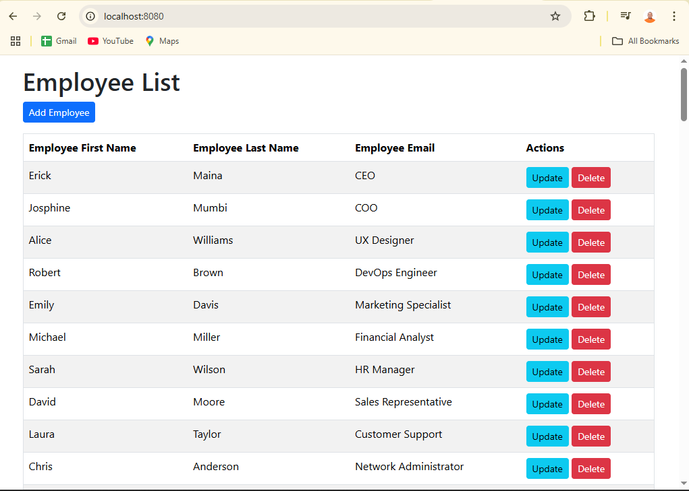
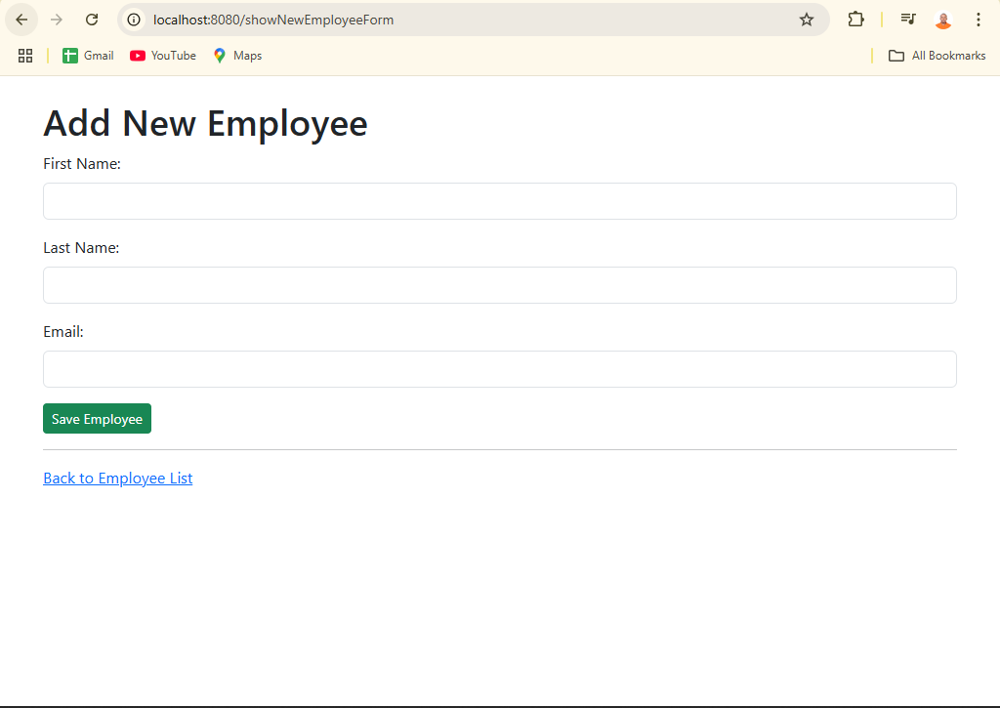
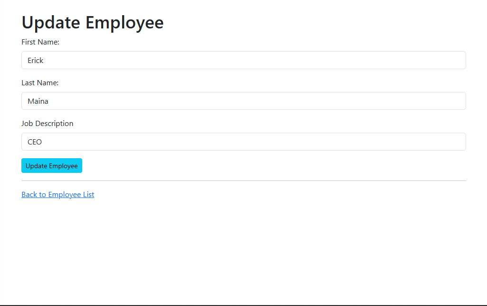

# Employee Management System

This is a simple **Employee Management System** built using **Spring Boot**, **Thymeleaf**, **PostgreSQL**, and **Bootstrap 5**. It provides basic CRUD operations to manage employees in a company.

## 🧰 Tech Stack

- **Java 17+**
- **Spring Boot**
- **Spring Data JPA**
- **Thymeleaf**
- **PostgreSQL**
- **Bootstrap 5**

---

## 📸 Screenshots

| Employee List | Add Employee | Update Employee |
|---------------|---------------|-----------------|
|  |  |  |

---

## 🔧 Features

- Add new employee
- View list of all employees
- Update existing employee details
- Delete employee
- Responsive UI with Bootstrap 5

---

## ⚙️ Installation & Run

### 1. Clone the repository

```bash
git clone https://github.com/your-username/ems.git
cd ems
